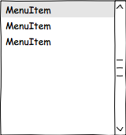

% Example Book
% John Doe
% January 27, 2012

# Chapter 1

some text in *italics* and **bold**

And of course

* some
* bulleted
* list

and a

1. numbered
1. list

Some code example:

~~~{.java}

public class Foo
{
   public Foo() {
   }
}

~~~

## subheader

### header 3

hyperlinks are [molgenis website](www.molgenis.org)

Images are almost the same but notice the !

apples
  : Good for making applesauce.
oranges
  : Citrus!
tomatoes
  : There's no "e" in tomatoe.
  
  size  material      color
----  ------------  ------------
9     leather       brown
10    hemp canvas   natural
11    glass         transparent

Table: Shoes, their sizes, and what they're made of

Alternative headers

# alternative level 1

test

## alternative level 2

test

## alternative level 3

test
